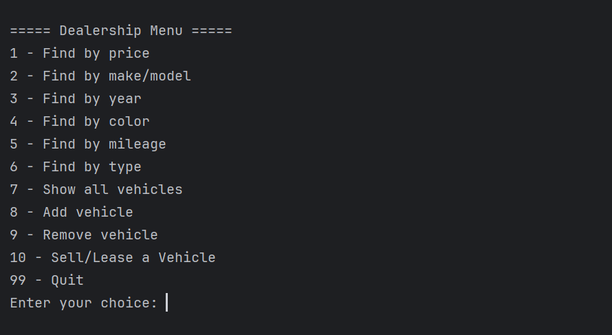
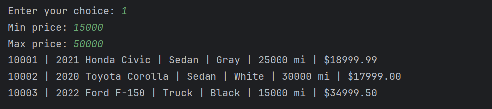
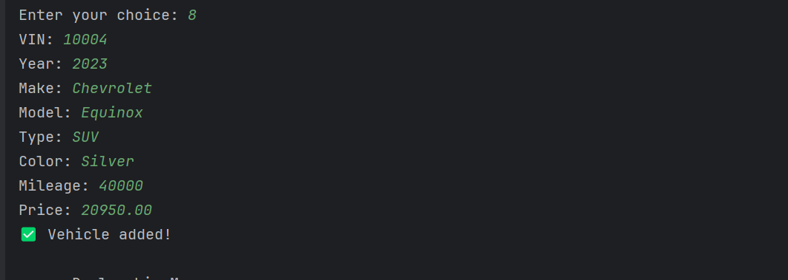
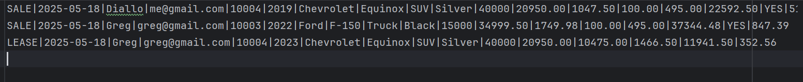

# 🚗 Dealership Management System

A powerful Java-based car dealership console application that supports searching, adding, selling, and leasing vehicles. The system generates and persists contract data in a structured CSV format.

---

## ✨ Features

- 📦 **Inventory Management**
- 🔍 **Search by Price, Make/Model, Year, Mileage, Type, Color**
- 🧾 **Sales & Lease Contract Generation**
- 💾 **CSV File Persistence**
- 🧠 **Object-Oriented Java Design (Abstraction, Inheritance, Polymorphism)**

---

## 📂 Project Structure

com/ps/
├── Vehicle.java
├── Dealership.java
├── DealershipFileManager.java
├── Contract.java (abstract)
├── SalesContract.java
├── LeaseContract.java
├── ContractFileManager.java
└── UserInterface.java

---

## 🧾 Contract Output Format

### 🔹 **Sales Contract**
SALE|YYYY-MM-DD|Customer Name|Email|VIN|Year|Make|Model|Type|Color|Mileage| Price|
Sales Tax|Recording Fee|Processing Fee|Total Price|Financed (YES/NO)|Monthly Payment

### 🔹 **Lease Contract**
LEASE|YYYY-MM-DD|Customer Name|Email|VIN|Year|Make|Model|Type|Color|Mileage|Price|
Ending Value|Lease Fee|Total Lease Obligation|Monthly Payment

> 💡 Contract records are automatically saved to `contracts.csv` when selling or leasing a vehicle.

---

## 📸 Screenshots

### 🧭 Main Menu

### 🔍 Search by Price

### ➕ Add Vehicle

### 💰 Sale Completed

### 📄 Contract Output (CSV)

---

## 🚀 How to Run

1. Clone the repository or open the project in IntelliJ.
2. Run `UserInterface.java` to start the app.
3. Use the menu to:
    - Add new vehicles
    - Search/filter inventory
    - Sell or lease a vehicle
    - Save contract and inventory changes

---

## 🧠 OOP Concepts Used

- ✅ Abstraction via `Contract` class
- ✅ Inheritance with `SalesContract` and `LeaseContract`
- ✅ Polymorphism in `ContractFileManager.saveContract(...)`
- ✅ Encapsulation via private fields and accessors

---

## 🗂 Sample Files

### inventory.csv
My Dealership|123 Main St|555-1234
10004|2019|Chevrolet|Equinox|SUV|Silver|40000|20950.00

### contracts.csv
SALE|2025-05-18|Diallo|me@gmail.com|10004|2019|Chevrolet|Equinox|SUV|
Silver|40000|20950.00|1047.50|100.00|495.00|22592.50|YES|512.65

LEASE|2025-05-18|Zach Westly|zach@texas.com|10005|2023|Tesla|Model 3|
Sedan|Red|5000|42999.99|21499.99|3010.00|24509.99|680.27

---

## 👤 Author

**Thierno Diallo**  
Software Engineer, Year Up United  
📧 podiallo2242@gmail.com  
📍 New York, USA

> Proudly built during the Year Up United Software Development Track 💻

---

## 📝 License

This project is licensed under the MIT License. See the `LICENSE` file for details.
